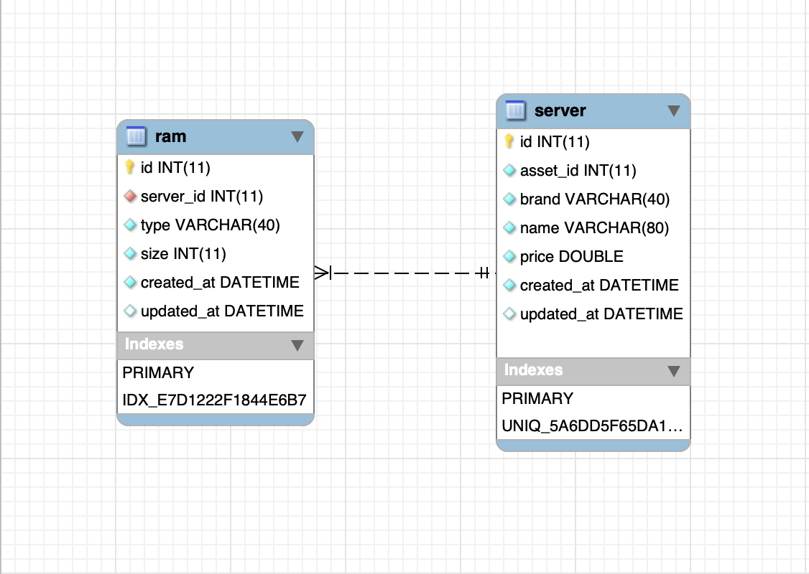
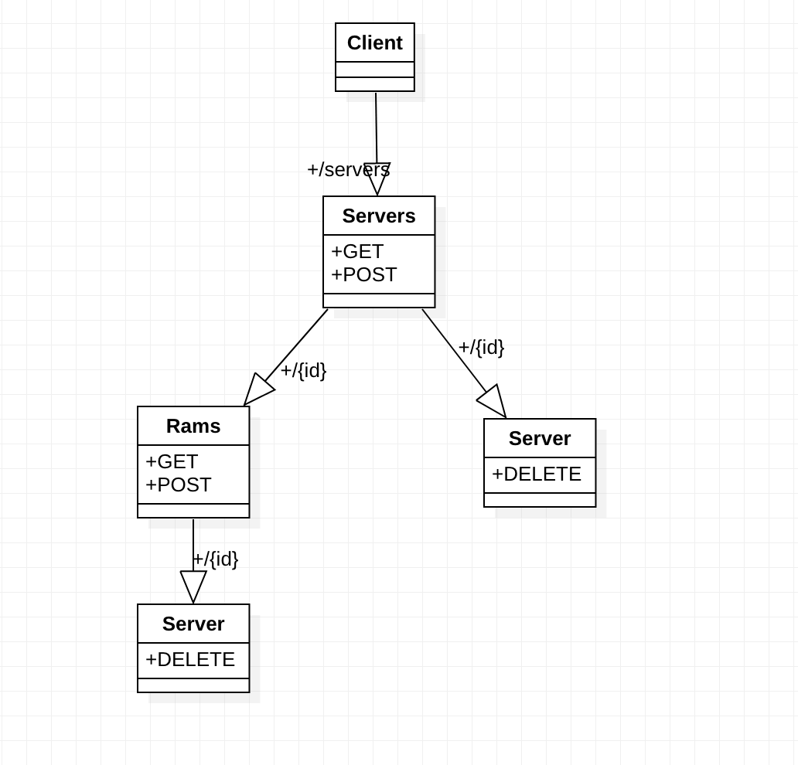

# Leaseweb API.
This is documentation for Leaseweb task using `Symfony v4.2`

# Deployed Version

Simple angular app using Leasweb APIs.

Angular: https://stark-refuge-54064.herokuapp.com

API: https://young-waters-39571.herokuapp.com

check API docs from [Here](#API-Documentation)
                         

# Getting Started

## Prerequisites
Make sure that you install `PHP v7.1.3`, `MySQL v5.7` and `composer`

## Development

#### Clone the source

```bash
 git clone https://github.com/Maghraby/leaseweb.git
```

#### Installing

```bash
 cd leaseweb
 composer install
```

###### Create database:

```bash
 php bin/console doctrine:database:create
```

###### Load database schema:

```bash
 php bin/console doctrine:migrations:migrate
```

###### Load data fixtures:

```bash
 php bin/console doctrine:fixtures:load
```

###### Note:
Please don't forget to change database URL from `.env` file

#### ER Diagram




#### Domain Model Digram.



#### Application Scenario
- Can list all servers via `/api/servers` using `GET` method.
- Can create servers via `/api/servers` using `POST` method.
- Can delete a server via `/api/servers/{id}` using `DELETE` method.
- Can get a server via `/api/servers/{id}` using `DELETE` method.
- Can list all rams via `/api/servers/{server_id}/rams` using `GET` method.
- Can create rams via `/api/servers/{server_id}/rams` using `POST` method.
- Can get ram that belongs to server  via `/api/servers/{server_id}/rams/{id}` using `GET` method.
- Can delete ram that belongs to server via `/api/servers/{server_id}/rams/{id}` using `DELETE` method.


#### API Documentation
Please check `swagger.yml` file

#### Running

```bash
 php bin/console server:run 
```

###### NOTE

This will use default port 8000


#### Testing

```bash
 php bin/phpunit
```

###### Note:
Please don't forget to change database URL from `.env.test` file